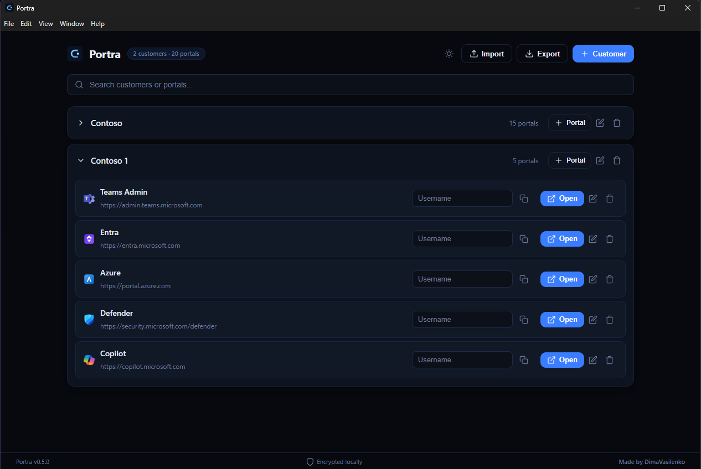
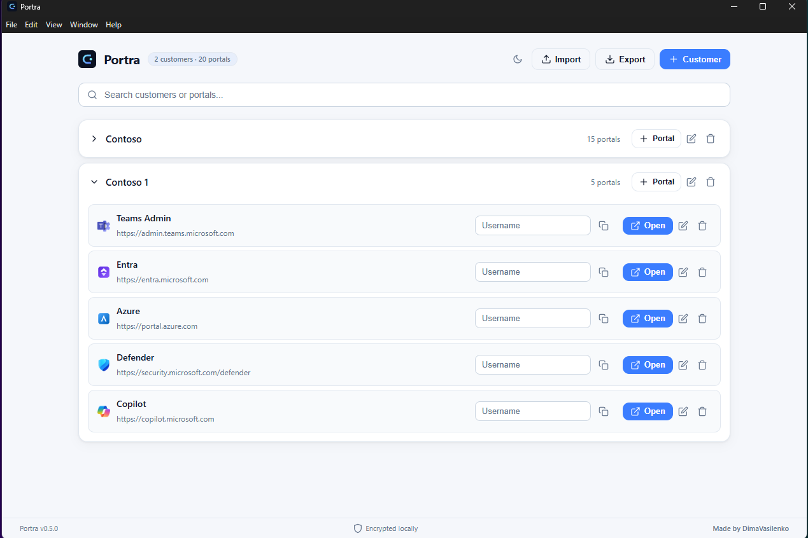
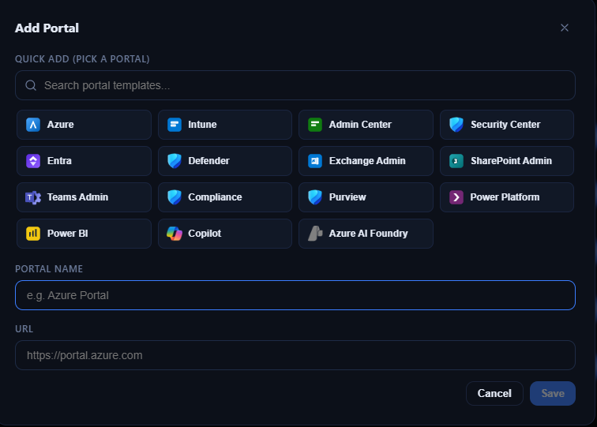
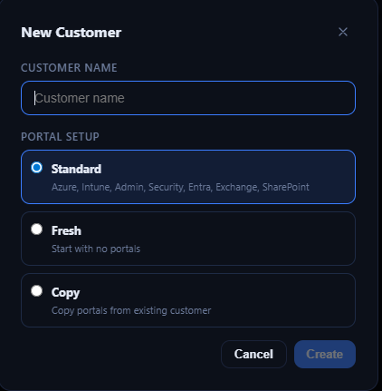

# Portra

A secure desktop app for managing and launching customer portals with isolated browser sessions.

<p align="center">
  
</p>

## Download

- **Windows (.exe):** https://github.com/DimaVasilenko-Intune/Portra/releases/latest
- **macOS (.dmg, universal — Apple Silicon and Intel):** https://github.com/DimaVasilenko-Intune/Portra/releases/latest

> **macOS: an extra step is required.** Portra is not yet signed with an Apple Developer ID, so
> macOS blocks it after download with *"Apple could not verify 'Portra' is free of malware"*.
> After moving Portra to Applications, run:
>
> ```bash
> xattr -dr com.apple.quarantine /Applications/Portra.app
> ```
>
> Or build it locally instead, which avoids the problem entirely (installs to
> `~/Applications`):
>
> ```bash
> npm install && npm run install:mac-local
> ```
>
> See [docs/MACOS.md](docs/MACOS.md) for why, and what it takes to remove the step for good.

## Screenshots

| Dark Mode | Light Mode |
|:-:|:-:|
|  |  |

| Add Portal | New Customer |
|:-:|:-:|
|  |  |

## Core features

- Customer and portal management (add/edit/delete)
- New customer options:
  - **Standard** (pre-configured with Azure, Intune, Admin Center, Security Center, Entra, Exchange Admin, SharePoint Admin)
  - **Fresh** (empty customer)
  - **Copy** (clone portals from another customer)
- **Built-in isolated browser** — each customer workspace opens portals in its own browser session with separate cookies and auth state (no Windows SSO leaking between tenants)
- Multi-select when adding portals (pick several at once)
- One username per customer workspace (encrypted at rest)
- Passkey / security key support (YubiKey, Windows Hello, etc.)
- Search, light/dark mode, import/export
- Import supports both **.json** and **.cfg** (including Portals app format)
- Back / Forward / Reload / Copy URL / Open in default browser for portal windows, from the menu and the usual shortcuts
- Automatic updates via GitHub Releases on Windows. On macOS, where the app is not yet signed,
  Portra says so and offers a manual **Check for Updates…**

## Security

- **100% local** — all data stays on your machine under your OS user profile
- Usernames are encrypted at rest with Electron `safeStorage` (OS keychain). If no keychain is
  available, Portra says so in the app rather than storing plain text silently
- Passwords are never stored or handled by the app
- Each customer workspace uses a dedicated Electron session with isolated cookies, localStorage, and auth — no cross-tenant leakage
- Context isolation and the Chromium sandbox are enabled in every window, including portal windows
- Portal windows may only load `https` URLs, and are granted only the permissions a portal needs
  (clipboard, fullscreen, USB/HID for security keys). Camera, microphone, geolocation and
  notifications are denied
- All portal icons are bundled. The only request Portra itself makes is the version check
  against the GitHub Releases API, and only when you ask for it
- No telemetry, no cloud backend, no sync, no accounts

### Platform differences worth knowing

| | Windows | macOS |
|---|---|---|
| Install | Signed installer, double-click | Unsigned — one `xattr` command, or build locally ([details](docs/MACOS.md)) |
| Automatic updates | Yes | Disabled until the app is signed. Portra says so in the footer and offers a manual check (also under **Portra → Check for Updates…**) |
| Windows Hello | Yes | n/a |
| Touch ID / iCloud Keychain passkey | n/a | **Not supported** — Electron does not expose the macOS platform authenticator |
| Security key (YubiKey, USB) | Yes | Yes |

## Run from source

```bash
git clone https://github.com/DimaVasilenko-Intune/Portra.git
cd Portra
npm install
npm run dev
```

## Tests

```bash
npm run check
```

## Build installers

```bash
npm run dist:win
npm run dist:mac
```

## Documentation

- [docs/MACOS.md](docs/MACOS.md) — macOS install, code signing, passkey support, data location
- [docs/IMPROVEMENT-PLAN.md](docs/IMPROVEMENT-PLAN.md) — review findings and prioritised plan

## License

MIT
